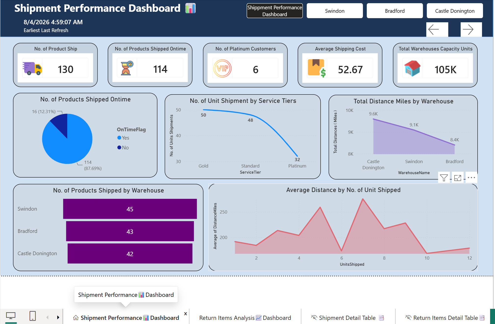
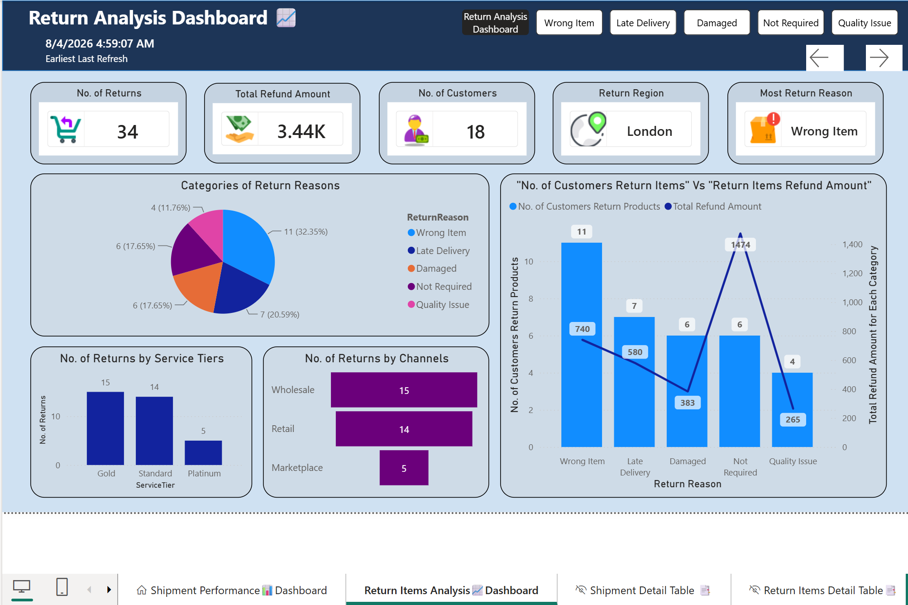
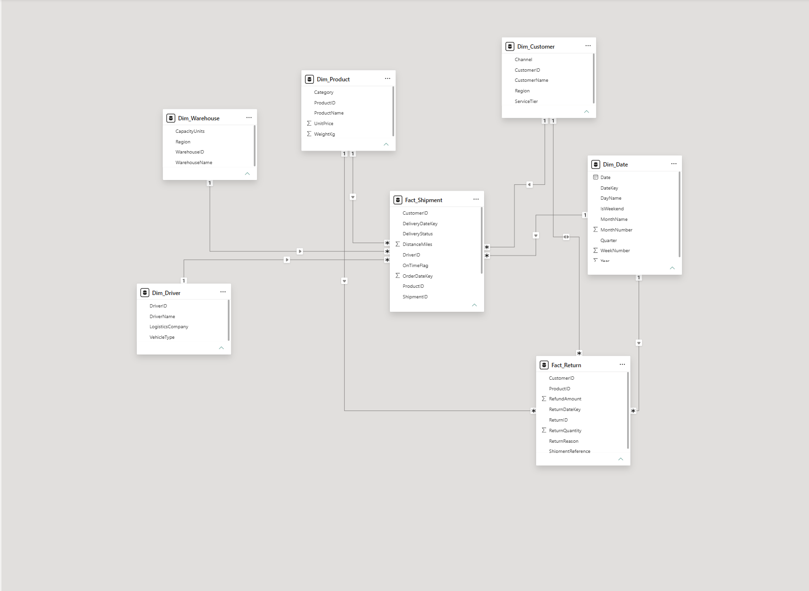

# Logistics Shipment & Returns Dashboard (Power BI)
An end-to-end data project analyzing shipment and return logistics — covering data cleaning and management in Excel and Power Query, star schema data modeling, and interactive data visualization in Power BI. The model connects shipment, return, customer, driver, product, and warehouse data to track delivery performance and return trends.

## 🔗 Live Interactive Dashboard
[View Walkthrough Video](logisticShipmentReturn.gif) <!-- add your video/GIF link here -->

## 📊 Preview
<!-- add a screenshot or GIF of the dashboard here -->

## 🛠 Tools & Techniques Used
* Excel: initial data cleaning and management of raw shipment/return data
* Power BI Desktop
* Power Query: further cleaned and transformed data, including reshaping tables before loading into the model
* Star schema data modeling: `Fact_Shipment` and `Fact_Return` fact tables connected to `Dim_Customer`, `Dim_Date`, `Dim_Driver`, `Dim_Product`, and `Dim_Warehouse` dimension tables
* Relationship modeling: configured one-to-many relationships with appropriate cross-filter directions to ensure filters propagate correctly across the model
* DAX: custom measures for delivery and return performance calculations
* Interactive features: slicers, buttons, bookmarks, and drill-through for report navigation
* Visual polish: icons, consistent formatting/alignment, and conditional formatting across visuals

## 📌 Report Breakdown
* **Overview Page:** high-level shipment and return metrics with slicers for date/warehouse/product filtering
* **Delivery Performance:** breakdown of shipment trends by driver and warehouse, using conditional formatting to flag delays or outliers
* **Returns Analysis:** drill-through page comparing return rates across products and customers
* **Navigation:** bookmark-driven navigation between report states, with buttons for switching views

## 🔧 Skills Demonstrated
* Designing and implementing a star schema from raw relational logistics data
* Managing table relationships (one-to-many, single vs. cross-filter direction)
* Writing DAX measures for shipment/return performance analysis
* Building interactive navigation with bookmarks, buttons, and drill-through
* Debugging: identifying and resolving data/model errors encountered during development
* Cleaning and reshaping messy shipment data in Excel and Power Query before modeling

## 📂 Files
* `.pbix` file included — feel free to download and explore the model, or use it for your own practice
